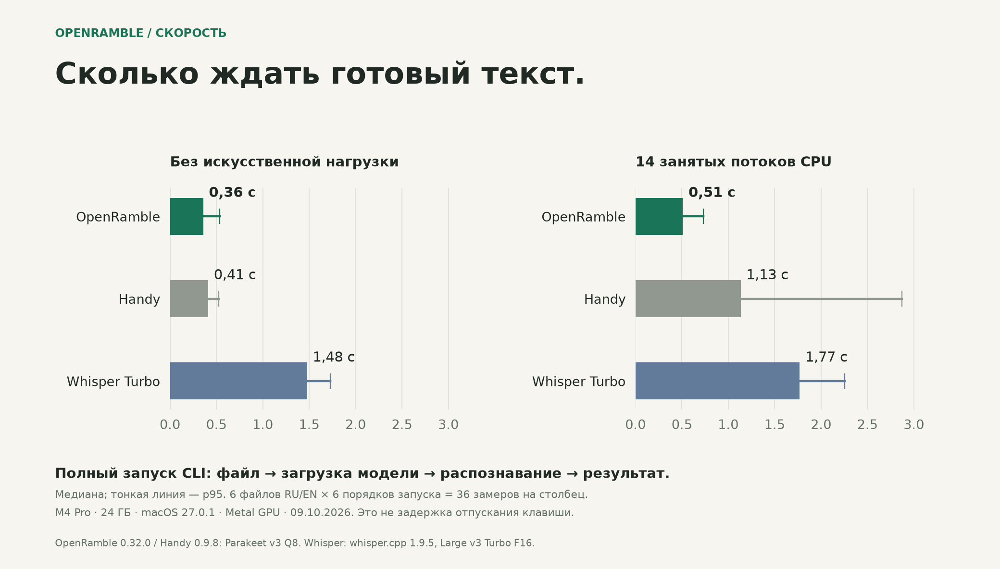
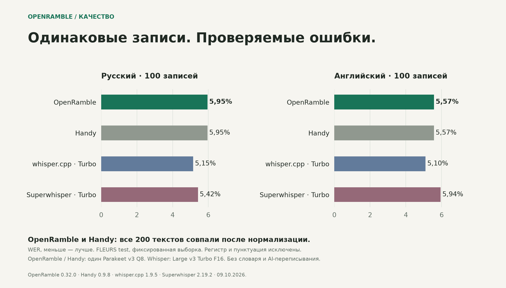
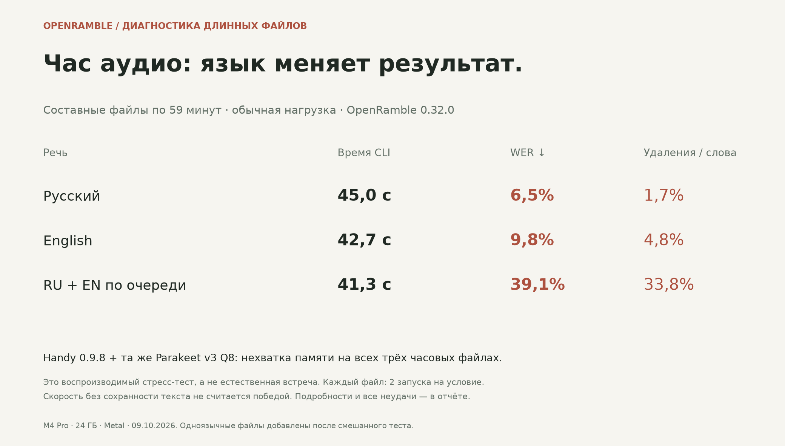

# OpenRamble, Handy and Whisper: quality + speed

Measured 9 October 2026 on one MacBook Pro M4 Pro (14 logical CPUs, 24 GB),
macOS 27.0.1. These are shipped file-CLI measurements, not physical dictation
latency. Models were already downloaded; OS file caches were warm, but each
measurement starts a new process and loads its model again.

## What the results support

OpenRamble's short-file CLI was more resilient to synthetic CPU pressure than
Handy's matched Parakeet configuration. Without that pressure their times are
close. OpenRamble and Handy produced identical normalized words on all 200
short inputs. There is no demonstrated overall accuracy win over Whisper.

| Complete CLI process, seconds | OpenRamble | Handy | whisper.cpp Turbo |
|---|---:|---:|---:|
| Normal desktop, median | 0.359 | 0.412 | 1.478 |
| Normal desktop, p95 | 0.535 | 0.525 | 1.730 |
| 14 busy CPU processes, median | 0.511 | 1.134 | 1.770 |
| 14 busy CPU processes, p95 | 0.731 | 2.872 | 2.256 |

Six short files, shortest/median/longest per language (4.5–29.3 s), six balanced
product orders, two alternating load conditions: 36 observations per cell.
Successful results only contribute times; every failure remains in the data.
All 216 observations in this speed matrix completed successfully. The host is
a working desktop, not a dedicated isolated lab. No other benchmark, model
download or build ran during these final timed batches.

| WER, lower is better | Russian: 100 files | English: 100 files |
|---|---:|---:|
| OpenRamble · Parakeet v3 Q8 | 5.95% | 5.57% |
| Handy · same Parakeet v3 Q8 | 5.95% | 5.57% |
| whisper.cpp · Large v3 Turbo F16 | 5.15% | 5.10% |
| Superwhisper · local Whisper Turbo F16 | 5.42% | 5.94% |

WER counts word substitutions + deletions + insertions divided by reference
words. Unicode NFC, lowercase, ё→е, alphanumeric tokens; punctuation removed,
numerals not expanded. One normalization for all products. Failed runs count
as empty output. These are point estimates on a small fixed sample, not a
significance claim. Superwhisper's internal processing timer is not comparable
to whole-process timing and is excluded from the speed chart.

## Long files: retain the negative results

These are composites of complete public utterances with 0.5-second silence
between them, not natural meetings. Inputs repeat to reach an approximately
59-minute target. Two runs per product/file/load condition.

| Speech in composite | Duration | OpenRamble median normal / load | WER | Deleted reference words |
|---|---:|---:|---:|---:|
| Russian | 3,550.1 s | 45.01 / 57.56 s | 6.49% | 1.71% |
| English | 3,546.8 s | 42.73 / 56.73 s | 9.76% | 4.80% |
| Alternating RU/EN | 3,543.3 s | 41.35 / 52.85 s | 39.07% | 33.80% |

Both monolingual files were added as an explicitly documented follow-up after
observing 39% WER on the mixed hour. They do not replace that failed quality
result. All repeated outputs were deterministic after normalization.

Handy 0.9.8 with this Parakeet v3 Q8 configuration failed with a Metal memory
allocation error on all 12 hour-file attempts. Failure duration is not a speed
result. Its other models were not tested. OpenRamble's measured peak resident
memory for these files was about 1 GB. Completion/exit zero alone does not
prove text completeness.

The original mixed 1-minute and 10-minute inputs are also retained. OpenRamble
WER was 21.32% and 36.57%; Handy WER was 42.65% and 72.96%. The engineering
priority exposed here is long mixed-language completeness. The benchmark does
not identify whether the cause is the model, segmentation, word timing, or
joining; it must not be reported as a diagnosed bug in one component.

A live meeting is another scenario: OpenRamble processes chunks while recording,
so after Stop only the tail and any queued work remain. Neither an hour-long
live meeting nor physical key-release-to-insertion latency was timed here.

## Exact configurations

| Product | Configuration |
|---|---|
| OpenRamble | Official signed 0.32.0 (75), source `3c5aaf93c30d94a21203c7501ada28b2c0dc199a`; shipping `openramble-cli`, transcribe.cpp 0.2.3 |
| Handy | Official unpatched 0.9.8, source `14f6f0d31cb22a4268acfbddba3052820fd0a06e`; portable default settings, explicit Parakeet v3 Q8, auto GPU/language; transcribe.cpp 0.2.4 |
| Whisper | Official whisper.cpp v1.9.5, source `d1be6fde11ac6e0407606b4e42fe72d34add8037`; Metal, flash attention, default 4 CPU threads, beam/best-of 5, language auto, no prompt or translation |
| Superwhisper | Installed 2.19.2, local `large-v3-turbo`; language auto, no AI rewrite, no translation; first 28 files via UI import, remaining 172 via official CLI 0.2.0 |

OpenRamble and Handy used the same Parakeet weight file, SHA-256
`5859f77944efcd8eafa23a6350731960b2b55b2203df51f319665c807d802cc7`.
Whisper Turbo F16 SHA-256
`1fc70f774d38eb169993ac391eea357ef47c88757ef72ee5943879b7e8e2bc69`
matches the official Hugging Face LFS object. These are useful shipping
configurations, not matched precision or parameter-count models.

The corpus is Google FLEURS `test`, revision
`70bb2e84b976b7e960aa89f1c648e09c59f894dd`, CC BY 4.0. Filenames were SHA-256
ranked using seed `openramble-handy-product-cli-20261009-v1` before observation;
first 100 per language. Do not select replacement examples based on results.

## Evidence and repeatability

- [Reproduce](REPRODUCE.md), [numbers](data/products-benchmark.json),
  [frozen input manifest](data/manifest.json), [protocol](data/protocol-v2.json).
- [Observations](data/observations.jsonl), [raw output archive](data/raw.tar.gz),
  [long follow-up](data/protocol-long-mono.json), [SHA256SUMS](data/SHA256SUMS).
- The [excluded pilot](data/excluded-pilot.tar.gz) overlapped a model download.
  It is preserved and excluded from the headline timing data.
- [Exact executed scripts](data/executed-benchmark-scripts.tar.gz) retain the
  original local paths. `scripts/` provides portable paths and records actual
  bundle versions; it does not change measurement semantics.
- Superwhisper public rows retain model/settings, public-corpus text, timing,
  and a hash of each original record. Unrelated device/context fields are omitted.
- No private speech, model weights, binaries, or audio archives are committed.
  Dataset attribution and source download instructions appear in REPRODUCE.md.

The older 3,422-input model study in `research/asr-benchmark-2026-10` used a
Mac mini M4/16 GB and is separate. Its timings, synthetic examples and the old
patched Handy experiments are not part of this product comparison.

Validation: three Swift package suites passed (LocalASR retains 3 documented skips). Python scripts compiled; portable runner smoke completed on all three CLIs; all 859 retained raw-output records passed SHA checks; all four score sections reproduced from the copied evidence. No shipping product code changes.
